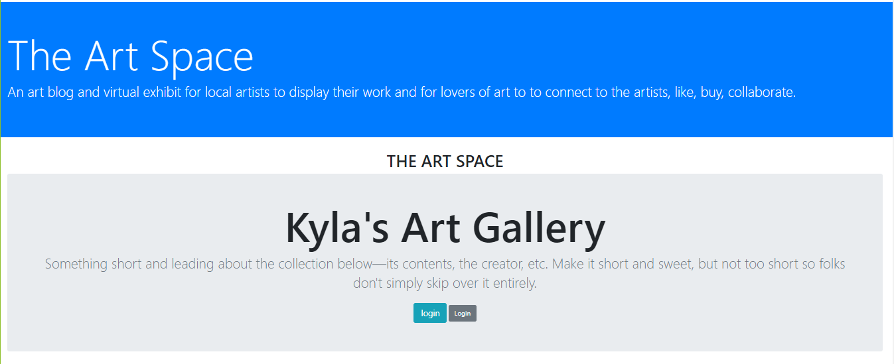
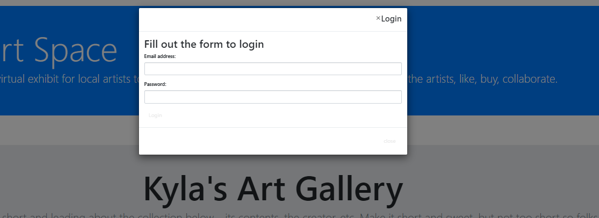
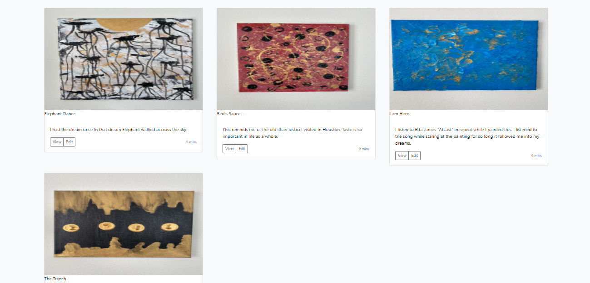

# The Art Space

## Description

<!-- Move it! is a place where you can find your next job (elevator pitch)  ...
This app was created with Javascript, JQuery, Bootstrap, & Materialize.-->
The Art Space is a central hub to discover, engage, and appreciate new and emerging artists and their talents. Artists can sign up for the site and upload their own art. The Art Space is also a gallery to purchase, like, and comment on any particular art piece.  Allowing interaction between the user and any available artist. The application was built using Nodejs, HandleBars, Bootstrap, Sequelize, MySQL and it makes full use of being mobile responsive. 


## Table of Contents

* [Images](#images)
* [Links](#links)
* [Contributors](#contributors)
* [Usage](#usage)
* [Installation](#installation)
* [Questions](#questions)
* [License](#license)

## Images







## Links

[TheArtSpace]()
<!--this is where our Heroku link  goes. -->

## Contributors

<!--name, role in project, what they did -->
The following team brought this project to life: 

```
Kyla Scott: Created . 

Nellia Fleurova-Char: Created . 

Vanessa Nguyen: Created .

Waleed Baig:  Created . 

Guillermo Bernal: Created README.md, styled the page using bootstrap, worked on possible future features. Role was mainly Front-End. 
```

## Usage

<!-- explain to the reader how they are suppose to use the application-->

## Installation

To install required dependencies:

```
npm install
```

## Questions

You can check out the rest of our projects here or reach out if you have any questions:

* [Guillermo Bernal](https://github.com/guillermobernal)
  contact email address: test@test.com

* [Waleed Baig ](https://github.com/wtbaig)
  contact email address: test@test.com

* [Nellia Fleurova-Char](https://github.com/NelliaFC)
  contact email address: test@test.com

* [Kyla Scott](https://github.com/guillermobernal)
  contact email address: test@test.com

* [Vaness Nguyen](https://github.com/guillermobernal)
  contact email address: test@test.com

## License

This project is licensed under 


